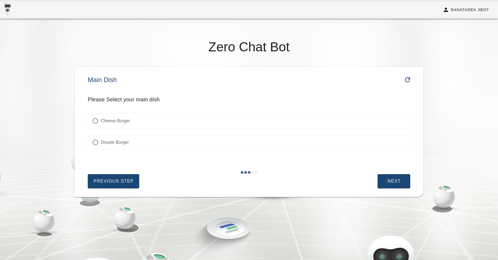

# Chatflows


Chatflows are an interactive communication bot that can be used to interactively ask the user some questions then perform actions based on the user's choices. think of serving a customer, handling invoices, buying items or in our case provisioning workloads on the grid.

## Usage

it's very easy to define a new bot, you just need to make sure it's added in a package and that package is installed. The chatflow should be under the `/chatflows` directory in the package created.

Here is an example for a simple chatflow that will help you order a meal from one of your favorite restaurants

```python
def chat(bot):
    # Sample data
    menus = {
        "3 Burger": {
            "main": ["Cheese Burger", "Douple Burger"],
            "sides": ["fries", "Onion rings"],
        },
        "3 Pizza": {
            "main": ["Chicken Pizza", "Beef Pizza", "Cheese Pizza"],
            "sides": ["fries", "Cheese"],
        }
    }

    # Ask the user about his name
    name = bot.string_ask("Hello, What's your name?")

    # display a dropdown containing your favourite Restaurants
    restaurant_name = bot.drop_down_choice("Please select a Resturant", menus.keys())

    # display the main dishes of the selected restaurant so the user can choose only one dish
    main_dish = bot.single_choice("Please Select your main dish", menus[restaurant_name]["main"])

    # ask about the mount (this accepts any integer)
    amount = bot.int_ask("How many {} do you want".format(main_dish))

    # ask about the side dishes (the user can choose multible side dishes)
    side_dish = bot.multi_choice("what do you want with your order", menus[restaurant_name]["sides"])

    # Now you can add any logic you want here to send the order to the restaurant
    # Then we can show a report to the user about his order using md format
    report = """# Hello {name}
    your order has been confirmed
    you have ordered : {amount} {main_dish] with {side_dish}
    """.format(name=name, amount=amount, main_dish=main_dish, side_dish=side_dish)

    bot.md_show(report)
```

Home page lists all of the registered chatflows

## Chatflow

We register a sample chatflow `food_get` in threebot

it's as easy as 


```python
from Jumpscale import j
import gevent


def chat(bot):
    """
    to call http://localhost:5050/chat/session/food_get
    """

    res = {}
    waittime = bot.int_ask("Wait time")
    bot.loading_show("progress", waittime)

    food = bot.string_ask("What do you need to eat?")
    amount = bot.int_ask(f"Enter the amount you need to eat from {food} in grams")
    sides = bot.multi_choice("Choose your side dishes: ", ["rice", "fries", "saute", "mashed potato"])
    drink = bot.single_choice("Choose your Drink: ", ["tea", "coffee", "lemon"])

    res = f"""

    # You have ordered:
    - {amount} grams,sides {sides} and {drink} drink
    ### Click next
    for the final step which will redirect you to threefold.me
    """
    bot.md_show(res)
    bot.redirect("https://threefold.me")

```
Here's how it will look like 

Asking what to eat as a string `string_ask`


Asking for amount as int `int_ask`

Asking for side dishes as multiple choice `multi_choice`


Asking for drink as single choice `single_choice`

Showing final results using md_show

For more technical information on the chat package please check [Internals page](internals_chat.md)


### Available question types:

- string_ask
- password_ask
- text_ask
- int_ask
- single_choice
- multi_choice
- drop_down_choice
- md_show
- country_drop_down

## Internals

check [internals page](internals.md) for more information on the mechanics of chatbot and how to extend it.
