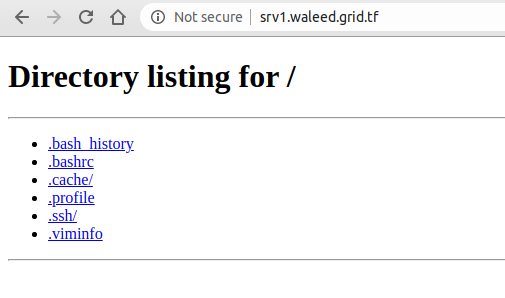

## Using the Web Gateway

### Overview

The aim is to delegate your domain to the gateway, access your running web applications using subdomains of your domain or any managed domains where we need to follow a few steps:

- choose a gateway
- delegate your domain to that gateway.
- create subdomains using that domain.
- create a tcp reverse proxy on the gateway.
- use `trc` flist to expose your running containers.

#### Choose a gateway

```python
# fetch all gateways
gateway_ids = {g.node_id: g for g in j.sals.zos.gateways_finder.gateways_search() if j.sals.zos.nodes_finder.filter_is_up(g)}

# fetch your pool
pool = j.sals.zos.pools.get(1)

# select a gateway available in your pool
gateway = None
for gid, g in gateway_ids.items():
    if gid in pool.node_ids:
        if not g.dns_nameserver:
            continue
        gateway = g
        break
if not gateway:
    raise j.exceptions.Input(f"pool {pool.pool_id} doesn't include any gateway")
```

#### Delegate your domain to the gateway

```python
# delegate your domain
DOMAIN = "waleed.grid.tf"
domain_delegate = j.sals.zos.gateway.delegate_domain(gateway.node_id, DOMAIN, pool.pool_id)
wid = j.sals.zos.workloads.deploy(domain_delegate)
```

got to your dns manager and create an `ns` record pointing to the gateway name `gateway.dns_nameserver[0]` then you can create subdomains of that domain and the gateway will create A records for it.

#### Create subdomains

```python
# we will use the gateway IP address for the subdomain to use it to expose our workloads
SUBDOMAIN = "srv1.waleed.grid.tf"
gateway_ips = []
for ns in gateway.dns_nameserver:
    gateway_ips.append(j.sals.nettools.get_host_by_name(ns))
subdomain = j.sals.zos.gateway.sub_domain(gateway.node_id, SUBDOMAIN, gateway_ips, pool.pool_id)
wid = j.sals.zos.workloads.deploy(subdomain)
```

now you can actually see that your subdomain is resorvable.


#### Create tcp reverse proxy

```python
# you need to have a secret for your reverse proxy which will be used by trc container to connect to the gateway. the format is {tid}:{arbitary_value}
import uuid
SECRET = f"{j.core.identity.me.tid}:{uuid.uuid4().hex}"

# create your tcp reverse proxy
reverse_proxy = j.sals.zos.gateway.tcp_proxy_reverse(gateway.node_id, SUBDOMAIN, SECRET, pool.pool_id)
wid = j.sals.zos.workloads.deploy(reverse_proxy)
```

#### create trc container to expose an already running workload

```python
# trc container initializes a tunnel with the gateway and forwards the traffic recieved on that tunnel to a specified address (the workload you want to expose)
# solution address config

SOLUTION_IP_ADDRESS = "10.212.2.2" # IP address of the workload you want to expose
SOLUTION_PORT = 8000
# I'm using an ubuntu container running python3 -m http.server to demonstrate so the below port will not be used
SOLUTION_TLS_PORT = 8443 
GATEWAY_IP = gateway_ips[0]

entrypoint = f"/bin/trc -local {SOLUTION_IP_ADDRESS}:{SOLUTION_PORT} -local-tls {SOLUTION_IP_ADDRESS}:{SOLUTION_TLS_PORT}" f" -remote {GATEWAY_IP}:{gateway.tcp_router_port}"

# trc container deployment
NODE_ID = "2m3nHPSAMyZFSeg5HPozic2NGBMtrXrBkhtNcVmd5Ss6"
NETWORK = "demo_net"
FLIST_URL = "https://hub.grid.tf/tf-official-apps/tcprouter:latest.flist"
CONTAINER_IP_ADDRESS = "10.212.2.10"
secret_env = {"TRC_SECRET": j.sals.zos.container.encrypt_secret(NODE_ID, SECRET)}
container = j.sals.zos.container.create(
    node_id=NODE_ID,
    network_name=NETWORK,
    ip_address=CONTAINER_IP_ADDRESS,
    flist=FLIST_URL,
    capacity_pool_id=pool.pool_id,
    entrypoint=entrypoint,
    secret_env=secret_env,
)
wid = j.sals.zos.workloads.deploy(container)
```

now you can access your server using the gateway


### 
