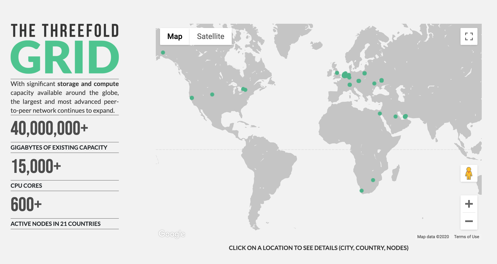

## Node

Hardwares are the low-level provider for digital capabilities. Hardwares provide components that enable software to create, process, transmit and store data. Nodes run an operating system to expose all embedded components in such a way that applications could use these components. Operating systems come in many different types, kinds, sizes and purposes. None of the existing operating systems have the characteristics of what the TF Grid needs:
- **Autonomy**: TF Grid needs to create compute, storage and networking capacity everywhere. We could not rely on a remote (or a local) maintenance of the operating system by owners or operating system administrators.
- **Simplicity**: An operating system should be simple, able to exist anywhere, for anyone, good for the planet.
- **Stateless**. In a grid (peer2peer) set up, the sum of the components is providing a stable basis for single elements to fail and not bring the whole system down. Therefore, it is necessary for single elements to be stateless, and the state needs to be stored within the grid.

With these particular design constrains, ThreeFold invented an efficient, simple stateless operating system called [Zero-OS](https://github.com/Threefoldtech/zos)

3Nodes are servers which run the [Zero-OS](https://github.com/Threefoldtech/zos) software. They provide storage, compute & networking capacities. Together, 3Nodes make up the capacity layers for the TF Grid. Today we have about 600 3Nodes across the grid. See more details [here](http://www2.cloud.Threefold.io)

Each 3Node comes with a bootloader software installed on a local storage device. The Zero-OS is delivered to them over the network,and the boot facility is hosted on the TF Grid itself.

### 3Node Operations

Complete these few steps below in order to install a 3Node and make it a part of the TF Grid:

1. Acquire a hardware
2. Create a farm
3. Create and download a bootloader (of a mechanism of your choice)
4. Power the hardware with electricity and internet access
5. Boot!

The details regarding this process is listed on the TF Grid's [wiki](https://wiki.Threefold.io/grid/readme#/grid/tf_farming/v2_jsx_farmsetup). The actual bootloader is very small. It brings up the network interface of you hardware and queries (web) servers for the remainder of the installation files needed. The operating system is not installed on any local storage facility nor is it installed on any state with regards to local operating systems. The hardware does not store any state of the OS, all of its containers, and other Zero-OS primitives.

The mechanism to allow this to work in a safe and efficient manner is a ThreeFold innovation called __Flist__. This is explained in more detail [here](architecture_flist.md)

### Zero-OS

Zero-OS is a very lightweight and efficient operating system. It supports a small number of _primitives_; the low-level functions it could perform natively in the operating system. There is no shell, local nor remote. It does not allow for inbound network connections to happen. Please visit [Zero-OS](https://github.com/Threefoldtech/zos/tree/master/docs) repository on Github to learn more.
