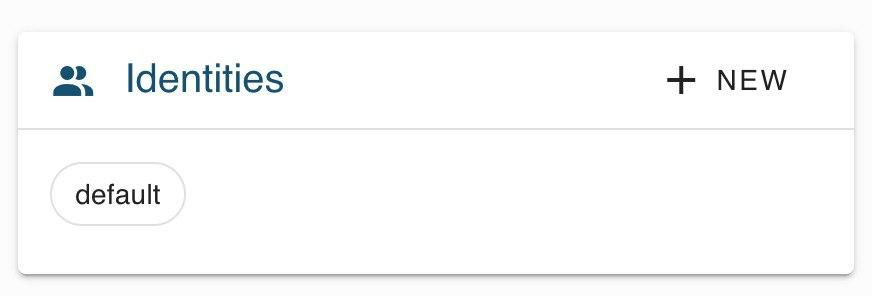
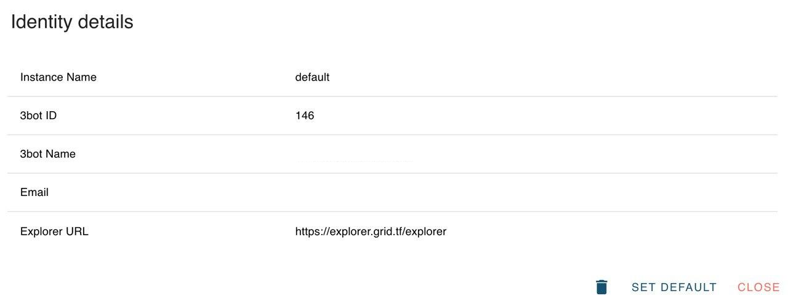
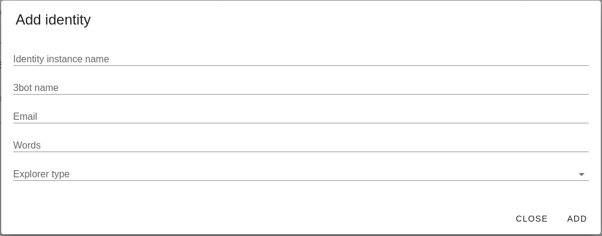
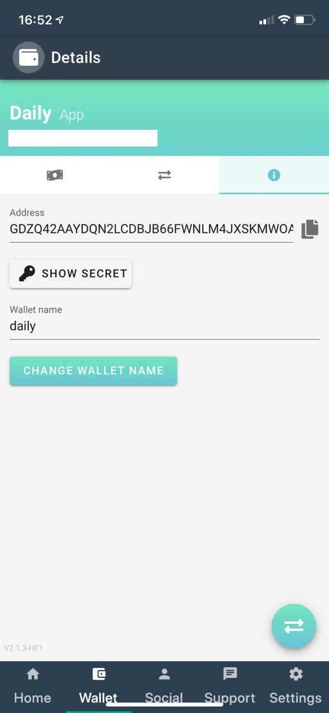

# Set up a farm

This document shows how to set up/migrate your Threefold Farm and 3Nodes. 

First your 3Bot should be up and running, either a hosted one, or the one manually installed on your local machine. On the 3Bot admin panel, there is tooling available to set up a farm and manage it. 
Go to the generated domain name that hosts your 3Bot, and login using your 3Bot connect app. 

## Choose Your Network Using Identities

First things is to select the identity with the network you want to create your farm on. Most probably you want to use `mainnet`.
To check the explorer instance of your identity, click on the `settings` tab and click on the current identity to see the explorer url of it.
Testnet url refers to `https://explorer.testnet.grid.tf`, mainnet url refers to `https://explorer.grid.tf`. 

If you want to switch to a different identity you could create a new one from the `ADD` button on the identities tab where you need to provide the secret words from your 3Bot connect app to get a registered identity and you could choose the explorer type corresponding to the network you need. For `mainnet` you could choose `Main network`.

## Install the Farm Management Application

Next step is to install the farm management application. To do so, click the `Farm Management` tab on the left side menu.
Then click `Install required packages` button

Once the package is installed, the page will reload the `farm management` UI will appear.

## Create a TF Farm

To create a new farm, click the little plus button on the top left corner:

It will open up a form to create a new Farm:

Fill the form with your values. 

**Make sure you add a valid TFT stellar address. This is required in order for user to be able to reserve capacity from your farm.**

Copy the address of the Stellar account from your 3Bot Connect app, where you could copy it from the wallet in the info tab on the detail screen of your farmer wallet.

A wallet also could be created or imported from your 3Bot Connect app in `Wallet Manager` in the sdk admin. Handy for having all at hand, required for reserving capacity. 

Once the farm is created you should see a new entry in the top table.

Notice the first colume of the table: ID. This is your farm ID, write this down cause you will need to use it when generating the 0-OS image for you the nodes of you farm.

## Create a Bootable Image

At this point you should have created your farm and noted its ID. The next step is to generate a bootable image of 0-OS to boot your nodes.

The bootstrap service: https://bootstrap.grid.tf is there for you to generate your 0-OS images.
In the bootstrap wizard, enter your farm ID, choose you network and download the generated image.
You are now ready to boot your nodes!

## Start 3Node with Bootable Image

After booting your 3Node it is visible on: [the TF Grid explorer](https://explorer.grid.tf)
