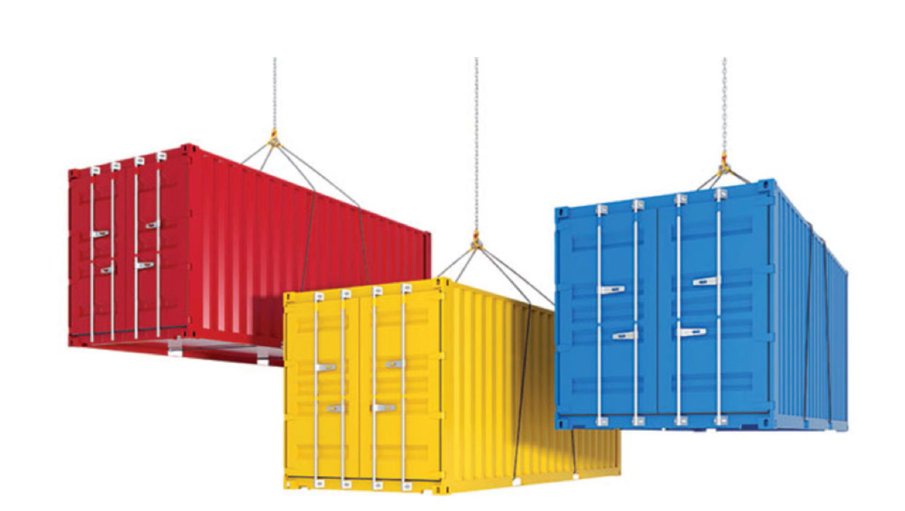

# Container



This primitive allows a user to run its application into a container on a node.

## Reservation definition

Here is the schema used to define a container reservation:

* **Flist**: the URL of the [Flist](#Flist). This URL needs to be reachable by

the node. This is usually a URL to https://hub.grid.tf/

* **HubUrl**: the URL of the hub to use, if not using the default hub.grid.tf
* **Environment**: the environment variables to set inside the container. This

is usually used to configure the application running in the container

* **SecretEnvironment**: it is the same as `Environment` but these values are encrypted
* **Entrypoint**: it is the program to start when the container is created
* **Interactive**: if set to true, coreX is started in the container and the value

of `Entrypoint` is ignored. See [the coreX section](corex---the-0-os-container-process-manager)
for more detail

* **Volumes**: this is where you define which volume to mount inside the container

 - **VolumeID**: the ID of the volume
 - **Mountpoint**: the path into the container filesystem where to mount the volume

* **Capacity**:

 - **CPU**: the amount of virtual CPU to allocate to the container
 - **Memory**: the amount memory in MiB to allocate to the container
 - **DiskSize**: the size in MiB of the root filesystem of the container
 - **DiskType**: the type of disk to use for the root filesystem of the container.
 Valid value are 'HDD' or 'SSD'.

* **NetworkConnection**: this is where you define the network of the container

 - **NetworkId**: the name of the network created using a [network](network.md)
 primitive
 - **Ipaddress**: net. IP: The IP address to give to the container
 - **public_ipv6**: if true, allocated a public IPv6 address to the container. This is useful when you want to expose service directly
 to the public internet and out of your private overlay network.
 - **yggdrasil_ip**: If true, allocated an yggdrasil IP address to the container. This will make the container directly accessible over the yggdrasil network.

* **Logs**: a redis backend where you could send stdout and stderr output
* **StatsAggregator**: a list of redis backend where you could send periodic statistics
* **Statistics**: a redis backend where you could send periodic statistics
* **pool_id**: the capacity pool ID to use to provision the workload

## Flist

More information about Flist at [Flist documentation](architecture_flist.md)

## CoreX - The 0-OS container process manager

When running a container, if you want an interactive way to use it, the easiest solution is enabling `CoreX` .

When CoreX runs in your container, you'll get web access to your container ( `container-ip:7681` ) via a web browser.
On this web page, you could track processes you run and attach them to get a remote console within your web browser.

It's like ssh over web page.

You could use `j.clients.corex` to start, stop, list etc. process on your Core X.

## Logs

In order to get your container logs easily readable and accessible, without adding anything to your container code, you could
provide some extra settings to get your logs (stdout and stderr) pushed remotely to a redis channel.

You could even specify multiple endpoint. For now only redis is supported but this could be extended in the futur.

In the reservation payload, there is a `logs` field where you could specify your endpoints:

``` 
 ...
 "entrypoint": "",
 "interactive": true,
 ...
 "logs": [
  {
   "type": "redis",
   "data": {
    "stdout": "redis://1.2.3.4:6379/container-stdout",
     "stderr": "redis://1.2.3.4:6379/container-stderr"
   }
  }
 ],
 ...
```

Fields `stdout` and `stderr` wants uri like: `redis://host:port/channel` .

You could read them via redis using `SUBSCRIBE container-stdout container-stderr` for example.

## Statistics

Like logs, you could send statistics to a (only for now) redis channel. Container will send each 2 seconds a statistic info into
the specified channel:

``` 
{
 "timestamp": 1586221435,
 "memory_usage": 561152,
 "memory_limit": 315621376,
 "memory_cache": 36864,
 "cpu_usage": 12129887,
 "pids_current": 1
}
```

To set your remote endpoint, you could specify in the reservation:

``` 
 ...
 "interactive": true,
 "logs": null,
 "stats_aggregator": [
  {
   "type": "redis",
   "data": {
    "endpoint": "redis://1.2.3.4:6379/container-stats"
   }
  }
 ],
 ...
```

Fields `endpoint` wants uri like: `redis://host:port/channel`
You could read them via redis using `SUBSCRIBE container-stats` for example.

## Example using sdk

``` python
zos = j.sal.zos

# add container reservation into the reservation
container = zos.container.create(node_id='2fi9ZZiBGW4G9pnrN656bMfW6x55RSoHDeMrd9pgSA8T', # one of the node_id s that is part of the network
     network_name='<network_name>', # this assumes that this network is already provisioned on the node
     ip_address='172.24.1.10', # part of ip_range you reserved for your network xxx.xxx.1.10
     Flist='https://hub.grid.tf/zaibon/zaibon-ubuntu-ssh-0.0.2.Flist', # Flist of the container you want to install,
     capacity_pool_id=12, # capacity pool ID
     disk_size=2048, # request a 2GiB of storage for the root disk for the container
     disk_type='SSD' # use an SSD for the root disk of the container
     # interactive=True, # True only if corex_connect required, default false
     env={"KEY":"VAL"},
     entrypoint='/sbin/my_init') #

# deploy the workload
id = zos.workloads.deploy(container)

# inspect the result of the reservation provisioning
time.sleep(10)
container = zos.workloads.get(id)
result = container.info.result

print("provisioning result")
print(result) # show the result of the reservation
```
