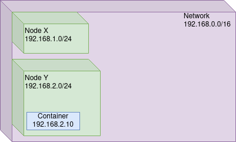

# ThreeFold Overlay Network


The network primitive allows a user to define its own overlay network between any of the nodes running Zero-OS. The technology we used to create the overlay network is [Wireguard](https://www.wireguard.com/). For setting it up on your local machine, please check the [Getting Started: Your First Network](getting_started_network.md) section. 

When you send a reservation that contains a network primitive, the overlay network will automatically get installed and started on all the nodes defined in your reservation.

This is the building block on top of which containers and kubernetes cluster communicate.

The goal is to build a secure and fully encrypted channel between all your applications running on the grid.

<!-- Broken link? -->
<!--  -->

## How to define a network?

A network is defined by its name and its subnet. 
The network subnet must be a 16-bit block within the private address space defined in [RFC1918](https://tools.ietf.org/html/rfc1918). So one from:

* 10.0.0.0  - 10.255.255.255 (10/8 prefix)
* 172.16.0.0  - 172.31.255.255 (172.16/12 prefix)
* 192.168.0.0  - 192.168.255.255 (192.168/16 prefix)

The 16-bit block is then splitted into 24-bit block and each node gets assigned one of these 24-bit block. 
So for example if you picked `192.168.0.0/16` as global network subnet, all the nodes get assigned a subnet from `192.168.1.0/24` to `192.168.254.0/24`.

To make it more visual imagine your network is like a big box full of IP addresses. The big box contains 65534 IP addresses (a 16-bit address block). 
For each node that joins the network, you reserve a part of the big box. 254 IP addresses for the node to use (the 24-bit block).
Finally, when you create a container or a kubernetes VM on a node, you assign one IP from the part that is reserved for the node.



to recap, to create a network you must:

* Pick a name.
* Pick a 16-bit block subnet.
* Choose all the nodes to add to your network and assign them a 24-bit block out.

### How do I access my overlay network from outside?

So far we only talked about how to interconnect all the nodes together. This is great but you as a user, also need to be able to access the network. Ether from your laptop or any part of your existing infrastructure.

To do so, you need to add an `external access` into the network. An external access is usually defined on one single node of your network, called the `entrypoint`.
An `entrypoint` is actually just a node that is part of your network that has a special configuration that allows you to connect to all the nodes of your network. The entrypoint is responsible to route the traffic coming from your laptop to all the other nodes of the network.

When creating such an `entrypoint`, the SDK returns you a wireguard configuration that you need to install on the laptop/server that you want to use to access the overlay network. Make sure to always copy this configuration in a safe place.

### IPv4 versus IPv6

Zero-OS is IPv6 first. ALl the communication between nodes go over IPv6. This allows to greatly reduce the amount of work needed to achieve real peer-to-peer.
But when it comes to `external access` IPv6 is maybe not the way to go since most of the world has not made the switch yet.

If you are creating an `external access` to your network and you want to use IPv4 to access the network, it is possible and the SDK has all the tools for it.
To achieve this you need to search for nodes with public IPv4 and use it as `entrypoint` when defining the `external access`. See the example below for more detail.

## Example using SDK

The network creation tool provided by the SDK tries to create a full mesh network. It means that it will try to make all the nodes directly connect to all the others nodes.

The API provided by the SDK abstracts all the complex logic required to create such a mesh. The only thing you need to care of is the subnet of the network and which node to add into your network. 

``` python
zos = j.sals.zos

# create a network object with name <network_name>
# the 16-bit block subnet chosen here is 172.24.0.0/16
network = zos.network.create(ip_range="172.24.0.0/16", network_name="<network_name>")

# find all node from farm with id <farm_id>
nodes = zos.nodes_finder.nodes_search(farm_id=<farm_id>)
# add each node into the network and assigned them a 24-bit block
for i, node in enumerate(nodes):
 iprange = f"172.24.{i}.0/24"
 zos.network.add_node(network=network,
       node_id=node.node_id,
       ip_range=iprange,
       pool_id=12)

# find a node that is public and has a ipv4 public IP
node = list(filter(zos.nodes_finder.filter_public_ip4, nodes))[0]

# create an 'external access' to the network for user laptop access using the public node as entrypoint
# we store the result of this command cause this is the configuration the user has to use to connect to
# the network from his laptop
wg_config = zos.network.add_access(network=network,
         node_id=node.node_id,
         ip_range="172.24.100.0/24",
         ipv4=True)

# deploy the network on each nodes:
for network_resource in network.network_resources:
 zos.workloads.deploy(network_resource)

print("wireguard configuration")
print(wg_config) # this is the config you need to use to configure the wireguard of your laptop
print("provisioning result")
```
> Related article: [Getting Started: Your First Network](getting_started_network.md)
