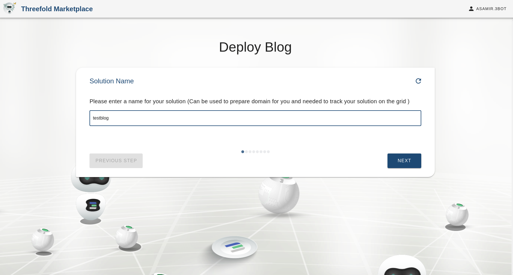
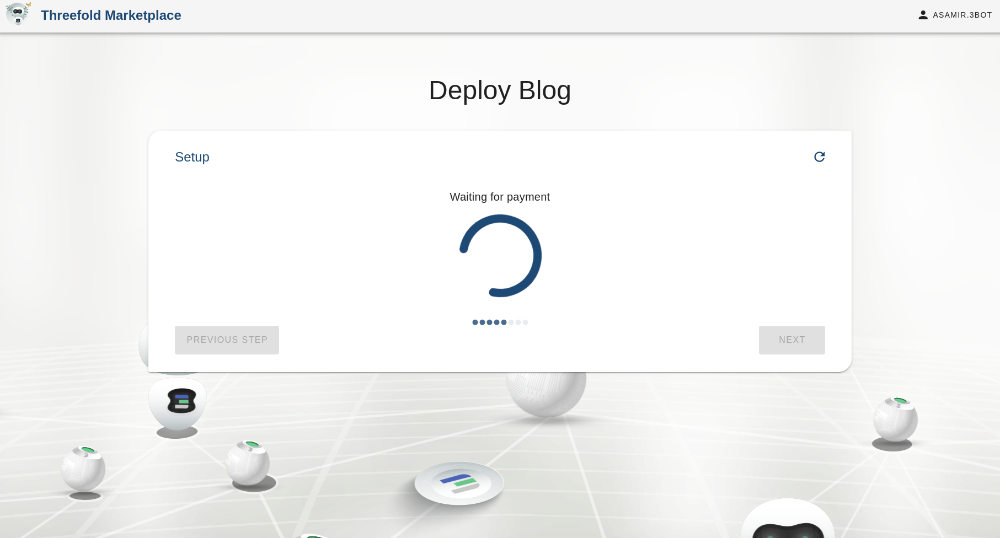
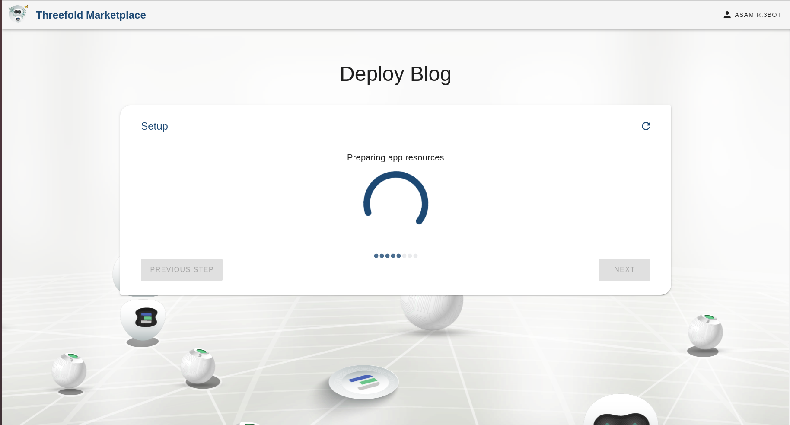
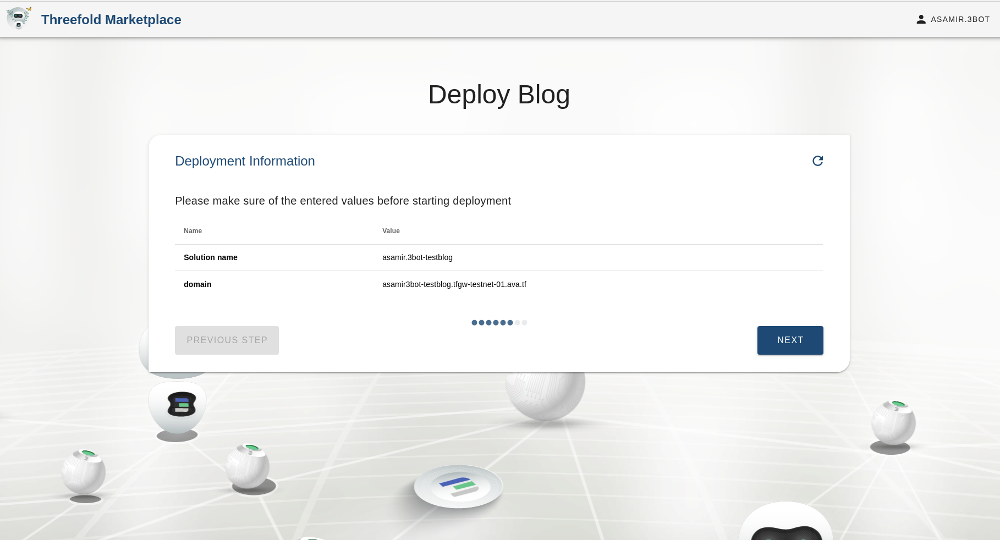
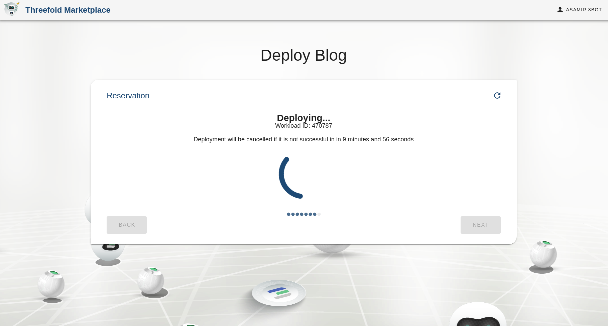

# Blog Publisher

Publisher is an online decentralised publishing tool that could be used to host wikis, websites, and blogs on top of the ThreeFold Grid. By creating and hosting your own publishing platform, users will no longer need to depend on centralised, hosted online publishing tools like blogspot, or wordpress. On this section we will teach you how to build and host your own Blog by using the Blog Publisher.

## Publish a Blog on Top if the ThreeFold Grid

### Name Your Blog Project

This name will be used to identify this blog on your 'deployed blogs list' on the 3Bot Admin Panel Dashboard. Keep in mind that this name would also be used as your blog's subdomain (a part of your blog's address).

### Add a Website Title, Repo URL and Branch

### Choose the Expiration Time

The expiration time determines how long you would want to keep this blog alive on top of the TF Grid. This will also calculate the amount of the internet capacity you would need to purchase to keep it online. No worries, you could always extend your blog's living span by extending your capacity. 

### Select Your Payment Currency

Choose how you would like to pay for the internet capacity you're going to use to deploy your website.

### Pay for Your Capacity by using a Stellar Wallet

You will be shown a payment details as below. Send the required amount to the mentioned address on your screen by using a stellar wallet. Please do not forget to mention the reservation ID on the memo text section when you're sending your payment. The memo text is used to identify a payment. Sending a payment without a memo-text could result in a failed transaction.

### Wait Until Your Payment is Succeeded

### Preparing Your Blog's Resources

### Summary of Your Deployment

### Final Deployment of Your Blog

### Congratulations, Your Blog is Successfully Deployed!
You could now access your new blog by entering the website address mentioned below onto your web browser.

An example of a successfully deployed blog:

